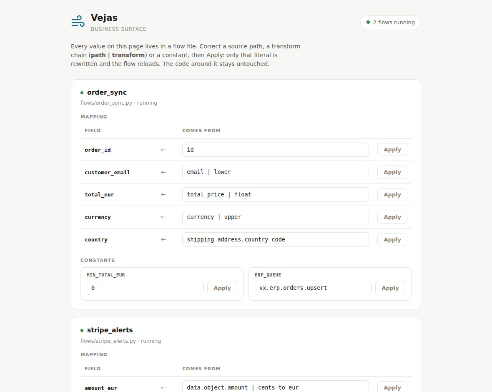

# Vejas

An integration platform with no builder UI. Flows are plain Python or Rust files written by your coding agent, reviewed in git, and run by a single Rust binary on NATS. Humans keep two screens: monitoring for operators, and a business panel where non-technical users validate and correct mappings and thresholds. The agent owns how; the human owns what it means.

Vėjas is the old Baltic god of the wind. Wind moves things without anyone drawing the route.

**Status: design & demo stage.** The manifesto explains the bet: [MANIFESTO.md](MANIFESTO.md).



## How it works

- **Runtime**: one Rust binary. Supervises flows, wires them to the bus, handles retries and backpressure, exports OpenTelemetry traces.
- **Transport**: NATS with JetStream (persistence, KV, object store). No other infrastructure dependency.
- **Connectors**: ordinary NATS services following a documented subject convention. Any language, isolated by construction, hot-replaceable.
- **Flows**: plain code in your own git repo. An agent writes them (an MCP server exposes scaffold / test / deploy / traces), you review the PR, CI tests, GitOps deploys.
- **UI**: no builder. Monitoring (topology, traces, `/surface`) for operators; a minimal business panel for domain users to review and correct the business surface (mappings, thresholds), rendered from literals in the code (`docs/MAPPINGS.md`). You never click to draw a flow.

## Quickstart

```bash
docker compose up          # nats + vejas, nothing else
# then point your agent at the MCP server and ask for a flow
```

(Demo recording: [link pending])

## License

Apache-2.0. A platform that argues against proprietary formats has to start with itself.
