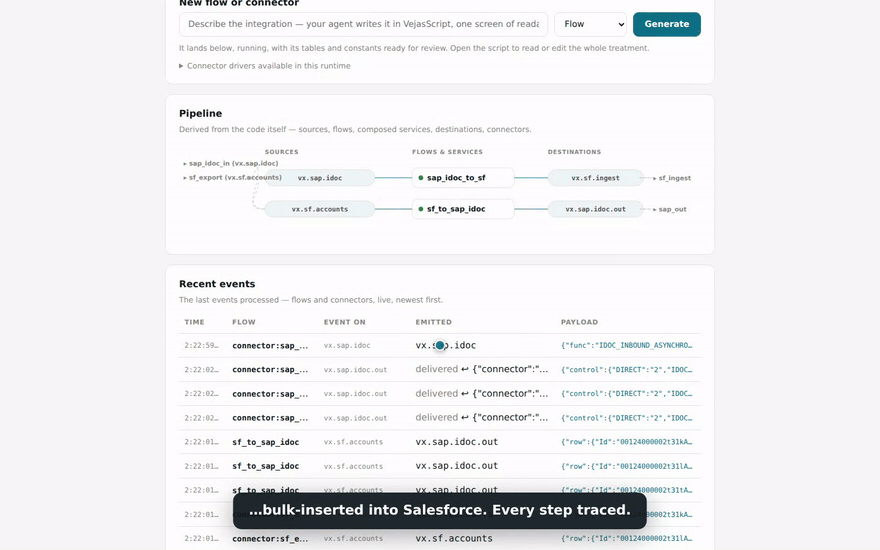

# Vejas

An integration platform with no builder UI. Flows are **VejasScript** — plain,
readable code written by your coding agent, reviewed in git, and run natively by
a single Rust binary on NATS. Humans keep two screens: monitoring for operators,
and a business panel where non-technical experts validate and correct
transcoding tables and thresholds. The agent owns *how*; the human owns *what it
means*. The whole platform is drivable over MCP.

Vėjas is the old Baltic god of the wind. Wind moves things without anyone
drawing the route.

**Status: young, but real** — the first production deployment runs today,
collecting NIS2 compliance evidence across four EU countries; interfaces still
move fast. Start here: [COOKBOOK](docs/COOKBOOK.md) · [VISION](docs/VISION.md) ·
[ARCHITECTURE](docs/ARCHITECTURE.md) · [ROADMAP](docs/ROADMAP.md) ·
[ADRs](docs/adr/) · [MCP](docs/MCP.md). The bet, long-form:
[MANIFESTO.md](MANIFESTO.md).

**The demo, 53 seconds** — a real SAP NetWeaver and a real Salesforce org,
bridged both ways by two readable flows; a domain expert corrects a business
rule on screen, the change is shadow-replayed on the real events, promoted,
and the next IDoc lives the corrected rule. The recording is also a green
end-to-end test ([the script](e2e/bridge-film.mjs)) — the video cannot lie.
[Full video (mp4)](docs/demo/vejas-bridge-film.mp4).



**Measured, not claimed** — reproducible on an 8-core dev machine
([methodology and comparisons](bench/)): cold start **11 ms**, **6–8 MB**
RSS under load (49 MB with fifty live flows), **4.9 MB** binary / **201 MB**
image, end-to-end p50 **6 ms** uncongested / 1 701/s sustained with **every
hop persisted** in JetStream. Same order of magnitude as engines that
persist nothing, in ~25× less memory.


Below: a flow an agent wrote from one sentence, in VejasScript. Its transcoding
table is seeded, samples come from the fixture, the emitted payload sits on top,
and the whole script is editable in the panel. A domain expert corrects any of
it without touching code:


## How it works

- **Runtime** — one Rust binary. Runs VejasScript flows in-process (a durable
  NATS consumer + the interpreter per flow), hot-reloads on edit, serves the
  panel and the MCP server. No Python, no subprocess. (ADR-0001, ADR-0009)
- **Transport** — NATS with JetStream, the only infrastructure dependency
  (persistence, KV, object store). Two containers, one `docker compose up`.
  (ADR-0002)
- **Clustering** — run N runtimes on the same NATS: flows load-balance and
  fail over natively (measured: an instance kill -9'd under load, every
  message still delivered exactly-all), singleton sources take a KV lease
  (graceful handoff 2.6 s, crash failover bounded by the TTL), and a
  clustered instance refuses local-file mutations — a live promote instead
  publishes a **version** every instance converges on (measured: 60 ms
  convergence, lossless mid-burst). (ADR-0020/0021, measured in
  [bench/](bench/))
- **Language** — VejasScript: `source` in, `emit` out, `invoke` to compose
  services (pipeline-merge composition), transcoding tables and thresholds
  as editable literals.
- **Packages** — group flows and services, hot-addable; cross-package calls go
  through `EXPORTS` (private by default) or the bus. (ADR-0003, ADR-0004)
- **Connectors** — a typed Rust **driver SDK** (`Driver` trait, Source/Sink).
  Bundled drivers: `http-in`, `timer`, `http-poll`, `oauth-poll` (a generic
  OAuth2 REST poller that stands in for much of a SaaS catalog), `slack-out`,
  `http-out`, plus the exec bridges (`exec-source`/`exec-sink`/
  `exec-stream-source`/`exec-rpc`), which wrap a program in **any language**
  over stdio, isolated by process. That is how the **SAP connector** ships:
  native Rust over the official `libsapnwrfc` C library — BAPI/RFC calls,
  IDocs in and out over tRFC, no JVM (ADR-0014) — and the **Salesforce**
  connector (OAuth2 + Bulk API 2.0, streaming). An instance is a declarative
  `.vjs` manifest, hot-addable, and an agent can write one from a prompt. The
  subject convention stays the whole interface, so an out-of-process connector
  is first-class. (ADR-0007, ADR-0011, ADR-0014)
- **Secrets** — `secret("path/key")` resolves from a Vault (HashiCorp KV v2; an
  env backend for dev) at run time. A secret is never a literal, so it never
  lands in git, the panel, or the business surface. (ADR-0008)
- **UI** — no builder. Monitoring (pipeline graph, statuses, a live feed of the
  last processed events) + a business panel where experts review and correct
  the business surface (rendered from literals in the code). A correction is
  **shadow-replayed on the flow's last real events** — before/after diff, then
  promote or discard. You never click to draw a flow. (ADR-0005)
- **Versioning** — a candidate version of a flow replays **yesterday's
  real traffic** (time-travel) or shadow-follows **live** traffic (canary),
  diffed side by side per event; unproven code never emits for real. Promote
  publishes the version cluster-wide (measured: 60 ms, lossless), audited,
  rollback included. (ADR-0021)
- **MCP & API** — the runtime is its own MCP server; a flow that declares
  `tool "…"` becomes a first-class MCP tool, and one that declares
  `api "VERB /path"` becomes a synchronous HTTP endpoint with an auto-generated
  OpenAPI document. The platform grows its own tool and API surface as you
  write flows. (ADR-0006, [docs/MCP.md](docs/MCP.md))

## Quickstart

```bash
docker compose up                              # nats + vejas, nothing else
claude mcp add --transport http vejas http://localhost:8686/mcp   # or any MCP client
# then ask your agent for a flow: it reads the language reference over MCP
# (vejas_language), writes the .vjs, tests it, and it lands running.
# The panel: http://localhost:8686 — a webhook entry: POST :8787/ingest/<subject>
```

Develop and test:

```bash
cargo test --manifest-path core/Cargo.toml     # language unit tests
core/target/release/vejas-runtime vjs-test tests/vjs   # golden end-to-end cases
```

Security defaults: the panel/MCP port (8686) binds to localhost only — that
surface can write flows and run commands (exec connectors), so expose it
deliberately. Set `VEJAS_TOKEN` and every write (POST, `/mcp` included)
requires `Authorization: Bearer <token>`. The webhook port (8787) only
publishes events onto the bus.

## License

Apache-2.0. A platform that argues against proprietary formats has to start with
itself.
