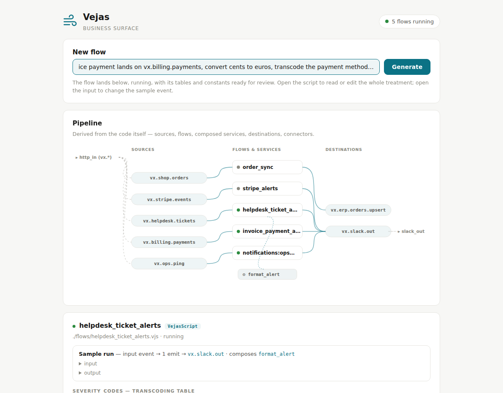
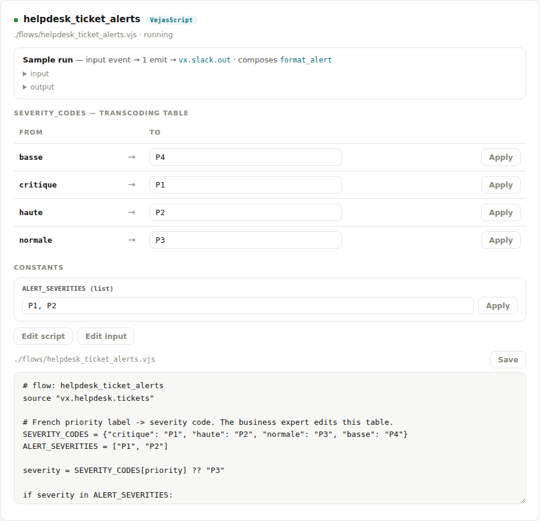

# Vejas

An integration platform with no builder UI. Flows are **VejasScript** — plain,
readable code written by your coding agent, reviewed in git, and run natively by
a single Rust binary on NATS. Humans keep two screens: monitoring for operators,
and a business panel where non-technical experts validate and correct
transcoding tables and thresholds. The agent owns *how*; the human owns *what it
means*. The whole platform is drivable over MCP.

Vėjas is the old Baltic god of the wind. Wind moves things without anyone
drawing the route.

**Status: design & demo stage.** Start here: [VISION](docs/VISION.md) ·
[ARCHITECTURE](docs/ARCHITECTURE.md) · [ROADMAP](docs/ROADMAP.md) ·
[ADRs](docs/adr/) · [MCP](docs/MCP.md). The bet, long-form:
[MANIFESTO.md](MANIFESTO.md).



Below: a flow an agent wrote from one sentence, in VejasScript. Its transcoding
table is seeded, samples come from the fixture, the emitted payload sits on top,
and the whole script is editable in the panel. A domain expert corrects any of
it without touching code:



## How it works

- **Runtime** — one Rust binary. Runs VejasScript flows in-process (a durable
  NATS consumer + the interpreter per flow), hot-reloads on edit, serves the
  panel and the MCP server. No Python, no subprocess. (ADR-0001, ADR-0009)
- **Transport** — NATS with JetStream, the only infrastructure dependency
  (persistence, KV, object store). Two containers, one `docker compose up`.
  (ADR-0002)
- **Language** — VejasScript: `source` in, `emit` out, `invoke` to compose
  services (webMethods-style pipeline merge), transcoding tables and thresholds
  as editable literals. Descended from [WmScript](https://github.com/cpoder/wmscript).
- **Packages** — group flows and services, hot-addable; cross-package calls go
  through `EXPORTS` (private by default) or the bus. (ADR-0003, ADR-0004)
- **Connectors** — bundled ones (`http-in`, `slack-out`) are native Rust
  threads; the subject convention is the whole interface, so an external
  connector in **any language** works over the bus. A typed connector SDK is
  next. (ADR-0007)
- **UI** — no builder. Monitoring + a business panel where experts review and
  correct the business surface (rendered from literals in the code). You never
  click to draw a flow. (ADR-0005)
- **MCP** — the runtime is its own MCP server; a flow that declares `tool "…"`
  becomes a first-class MCP tool. The platform grows its own tool surface as you
  write flows. (ADR-0006, [docs/MCP.md](docs/MCP.md))

## Quickstart

```bash
docker compose up                              # nats + vejas, nothing else
# then point your agent at http://localhost:8686/mcp and ask for a flow,
# or open the panel at http://localhost:8686
```

Develop and test:

```bash
cargo test --manifest-path core/Cargo.toml     # language unit tests
core/target/release/vejas-runtime vjs-test tests/vjs   # golden end-to-end cases
```

## License

Apache-2.0. A platform that argues against proprietary formats has to start with
itself.
