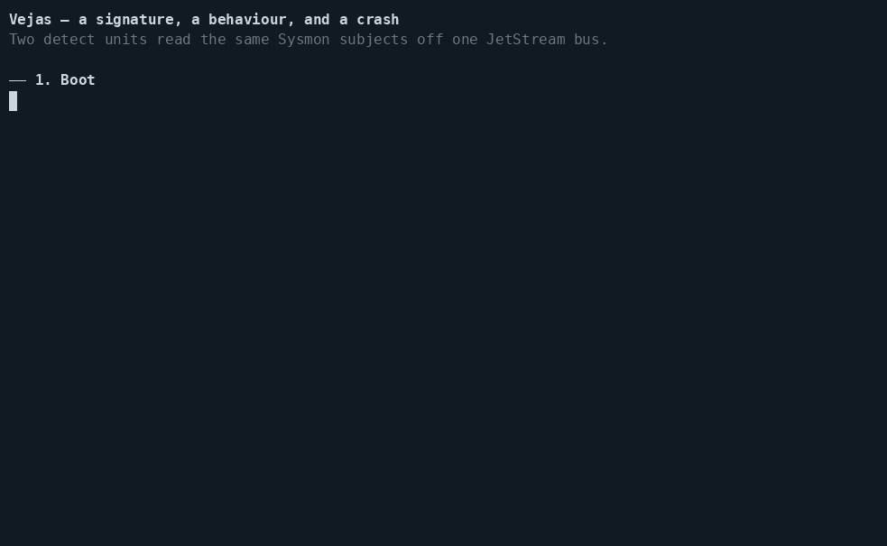

# The detect demo — a signature, a behaviour, and a crash



Four beats on one bus, each asserted, so this is a test as much as a film:

| Beat | What happens | What it proves |
|---|---|---|
| 1 | Two detect units boot and consume the Sysmon subjects | A VPL program is a unit like any other |
| 2 | A lazy attacker runs PsExec under its own name | Both the signature and the behavioural rule fire |
| 3 | The same attack, binary renamed `svcupdate.exe` | The signature goes quiet; the sequence still fires (T1021.002) |
| 4 | `kill -9` between the two halves of a sequence | The alert still arrives, out of the unit's snapshot |

Beat 3 is the argument for correlation: a file name is a property of the
attacker's choosing, an SMB connection followed by a process under
`services.exe` is a property of the mechanism. Beat 4 is the one nothing
else shows: a stateful detection surviving a hard kill, because the unit
snapshots its engine state with the stream sequence it stands for and
resumes after it ([ADR-0031](../../docs/adr/0031-pattern-detection-unit-varpulis-engine.md)).

## Run it

```bash
cargo build --release --manifest-path core/Cargo.toml
e2e/detect-demo/run.sh                  # assert everything, about 40 seconds
PAUSE=manual e2e/detect-demo/run.sh     # wait for <enter> between beats, for filming
PAUSE=3 e2e/detect-demo/run.sh          # three seconds between beats
```

It brings up its own `nats-server -js` on 4330 and its own runtime on 8730,
with a throwaway store; nothing is shared, and teardown is by captured PID.
`VEJAS_BIN=<path>` runs it against another build — on the build before
snapshots landed, beat 4 fails, which is the point of it.

## What is in here

- `detect-demo-root/detects/lateral_movement.vpl` — the behavioural rule: a
  connection to port 445, then a process whose parent is `services.exe`,
  within two minutes of **event** time, on `vx.alerts.lateral`.
- `detect-demo-root/detects/sigma_psexec.vpl` — the same attack as a
  signature sees it: `Image` ends with `PsExec.exe`. On `vx.alerts.sigma`.
- `data/normal_dataset.jsonl`, `data/evasion_dataset.jsonl` — Sysmon events,
  four and six of them, the second with the binary renamed. Real field
  names (`Image`, `ParentImage`, `DestinationPort`, `@timestamp`), so the
  rules are the ones an analyst would write.

Each beat is replayed in its own hour of event time. That is not decoration:
the engine judges `.within()` against the events' own timestamps, so a
scenario replayed with earlier stamps than the last one is simply late, and
late events cannot open a sequence the watermark has passed.

The datasets and the two rules come from the Varpulis security demo, where
the same pair runs offline over a file. Here they run on a bus, in units,
across a crash.
